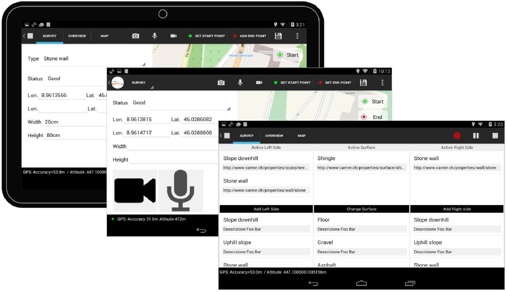

# Geo IVS
## Application for Android 4 (KitKat) tablets for the survey of cultural itineraries in Switzerland

Developed in the context of the Interreg Project: [Cammini della Regina](http://www.viaregina.eu/)

Presentation: https://slides.com/mantonovic/deck-1